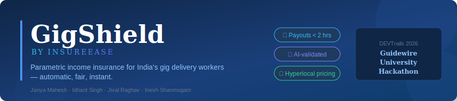
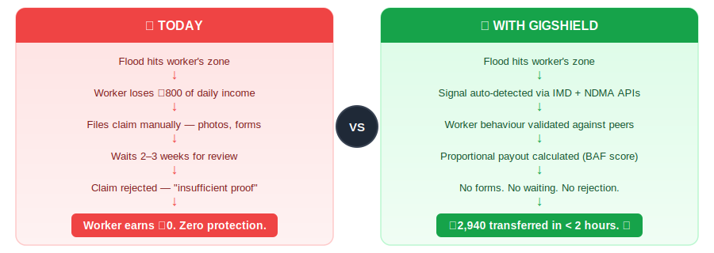
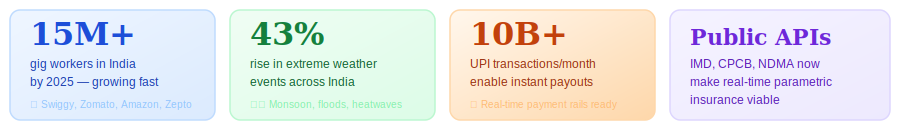
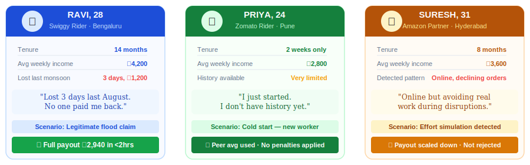
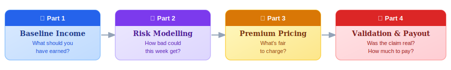
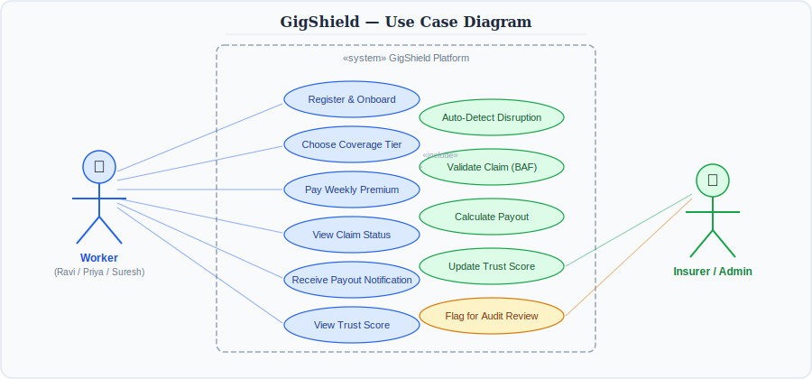
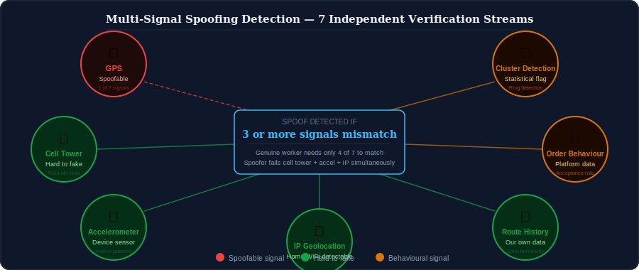
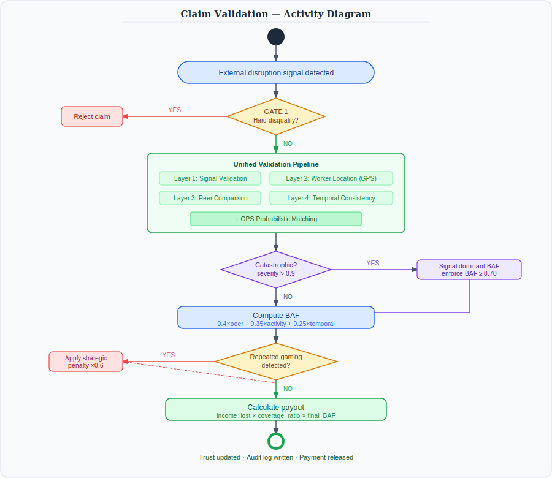
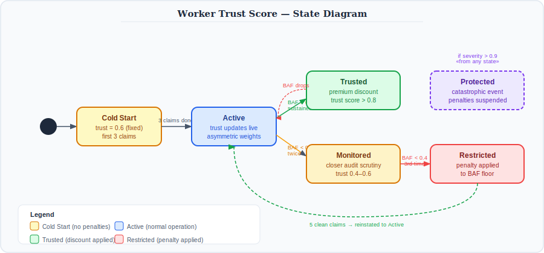
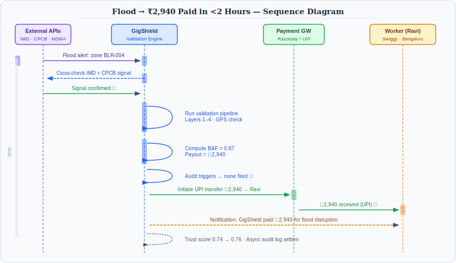

<div align="center">



</div>

---

## 📋 Table of Contents

### 🚀 The GigShield Story *(start here)*
- [The Problem](#-the-problem)
- [Why Now](#-why-now)
- [Meet the Workers](#-meet-the-workers)
- [How GigShield Works](#-how-gigshield-works)
- [Use Case Overview](#-use-case-overview)
- [AI/ML Integration](#-aiml-integration)
- [What Makes Us Different](#-what-makes-us-different)
- [vs Existing Solutions](#-vs-existing-solutions)
- [Parametric Triggers](#-parametric-triggers)
- [Feasibility](#-feasibility)
- [Tech Stack & Development Plan](#️-tech-stack--development-plan)
- [2-Minute Video](#-2-minute-video)

### 🛡️ Adversarial Defense & Anti-Spoofing
- [How We Handle GPS Spoofing & Coordinated Fraud Rings](#️-dversarial-defense--anti-spoofing-strategy)

### 🔬 Implementation Detail *(technical depth)*
- [Part 1 · Baseline Income Estimation](#part-1--baseline-income-estimation)
- [Part 2 · Disruption Risk Modelling](#part-2--disruption-risk-modelling)
- [Part 3 · Dynamic Premium Pricing](#part-3--dynamic-premium-pricing)
- [Part 4 · Validation, Payout & Trust](#part-4--validation-payout--trust)
- [Known Issues & Mitigations](#known-issues--mitigations)
- [Team](#-team)

---

## ❌ The Problem

India's 15M+ gig delivery workers have no income protection when floods, heavy rain, curfews, or extreme weather stop them from working. Traditional insurance is slow, manual, and rejects claims without clear reasons.



> *15 million gig workers. Zero income protection when external disruptions hit.*

---

## ⏳ Why Now



The convergence of a growing gig workforce, increasing climate volatility, real-time public APIs, and India's instant UPI payment rails makes this the right moment to build parametric income insurance for delivery workers.

---

## 👤 Meet the Workers



> *Three different workers. Three different situations. One system that handles all of them fairly.*

**Ravi** shows the happy path — legitimate flood claim, full proportional payout.
**Priya** shows cold start handling — brand new worker gets peer averages, zero penalties.
**Suresh** shows our anti-gaming approach — suspicious pattern detected, payout scaled down proportionally rather than rejected outright.

---

## 👤 How GigShield Works



**🔵 Part 1 — Baseline Income: What should you have earned?**

We look at your recent earnings, remove any days where disruptions already happened, and reconstruct what a genuinely normal week looks like for you. New workers are compared to similar riders in their zone until they build enough personal history. This becomes your counterfactual income — the anchor for every payout calculation downstream.

→ [See baseline estimation implementation details](#part-1--baseline-income-estimation)

---

**🟣 Part 2 — Risk Modelling: How bad could this week get?**

Every Monday, we pull weather forecasts, AQI data, flood alerts, and local event calendars for your specific delivery zone. A machine learning model trained on years of historical disruptions predicts how many days are likely to be disrupted and how severe each one will be. High-data zones are ML-driven; new zones lean on historical risk patterns.

→ [See risk modelling implementation details](#part-2--disruption-risk-modelling)

---

**🟡 Part 3 — Premium Pricing: What's fair to charge?**

Your weekly premium is calculated from your expected income loss for that week, adjusted for your zone's risk level and platform. Workers with a strong trust history get a small discount. We build in actuarial margins to keep the platform solvent even during bad monsoon seasons — and zone-level community pricing prevents adverse selection spirals.

→ [See premium pricing implementation details](#part-3--dynamic-premium-pricing)

---

**🔴 Part 4 — Validation & Payout: Was the claim real?**

When disruption hits, we don't just ask "did it happen?" — we ask "how much did it affect this specific worker?" We check GPS location, activity levels compared to peers in the same zone, and historical behaviour patterns. Instead of rejecting ambiguous claims, we scale payouts proportionally. Honest workers get full payouts. Suspicious patterns reduce the payout gradually — with repeated gaming penalised more firmly over time.

→ [See validation and payout implementation details](#part-4--validation-payout--trust)

---

## 🗺️ Use Case Overview



Three actor types interact with the system: **Workers** (register, pay premiums, receive payouts), the **GigShield Platform** (auto-detect, validate, calculate, pay), and **Insurers/Admin** (monitor dashboards, review flagged claims, track loss ratios).

---

## 🤖 AI/ML Integration

> *AI/ML isn't just used for prediction — it runs through every layer of the pipeline, from estimating what you should have earned to detecting when someone is gaming the system.*

| Module | ML Task | Model | Trained On |
|---|---|---|---|
| Baseline Estimation | Predict peer weekly income | XGBoost / Random Forest | Historical cleaned income, zone demand, calendar signals |
| Risk Modelling | Forecast disruption probability + severity | Gradient Boosting classifier | Weather signals, zone vulnerability, disruption history |
| Premium Pricing | Calibrate risk multiplier dynamically | Regression | Zone risk index, platform volatility, trust distribution |
| Claim Validation | Temporal consistency scoring | Sigmoid scoring function | Worker activity vs peer cluster behaviour |
| Anti-Gaming | Detect effort simulation | Rule-based + acceptance rate signal | Order acceptance patterns, online hours vs deliveries |
| Trust Scoring | Behavioural trust update | Asymmetric weighted moving average | BAF history, claim frequency, timing patterns |
| Spoof Detection | Multi-signal cross-verification | Anomaly detection | Cell tower, accelerometer, IP, route history |

---

## ✨ What Makes Us Different

<table>
<tr>
<td width="33%" valign="top">

### 🔄 Proportional, not binary

Most insurance says **yes** or **no**. We say **how much** — payouts are scaled to a worker's actual contribution during the disruption. An ambiguous case gets a partial payout, not a rejection letter.

</td>
<td width="33%" valign="top">

### 🧠 Behaviour-aware, not rule-based

We don't just check if rain happened. We check if rain affected **you specifically** — comparing your activity to peers in your exact zone and time slot at that moment.

</td>
<td width="33%" valign="top">

### 🤝 Trust builds over time

Good behaviour earns premium discounts. Gaming is penalised gradually across a 5-claim lookback window — never with sudden rejection. The system gets smarter the longer you use it.

</td>
</tr>
</table>

---

## 🆚 vs Existing Solutions

| Feature | Traditional Insurance | Existing Gig Products | **GigShield** |
|---|---|---|---|
| Claim process | Manual — forms + photos | Semi-manual | ✅ Fully automatic |
| Payout time | 2–3 weeks | Days | ✅ **< 2 hours** |
| Fraud handling | Reject | Reject | ✅ **Scale payout proportionally** |
| Personalisation | Low | Medium | ✅ **Hyperlocal + behavioural** |
| New worker support | None | None | ✅ **Cold start + peer baseline** |
| Gaming detection | None | Basic blacklisting | ✅ **Acceptance rate + trust scoring** |
| GPS spoof detection | None | None | ✅ **7-signal cross-verification** |

---

## ⚡ Parametric Triggers

> *Payouts are triggered automatically based on real-world external signals — no manual claims required.*

| Trigger | Threshold | Data Source | Payout Effect |
|---|---|---|---|
| Heavy rainfall | Exceeds operational mm threshold | IMD API, OpenWeatherMap | Scaled to rainfall intensity |
| AQI spike | Exceeds health threshold | CPCB real-time API | Partial to full day loss |
| Flood / waterlogging alert | Active warning in worker's zone | NDMA, State disaster APIs | High severity — peer ratio excluded |
| Curfew / lockdown | Active government notification | Official government feeds | Full day — signal-dominant calculation |
| Platform outage | Confirmed downtime | Platform API / monitoring | Activity weight reduced in formula |
| Extreme temperature | Heatwave or dense fog advisory | IMD forecasts | Zone-level severity adjusted |

---

## 🔧 Feasibility

- All disruption signals (weather, AQI, flood alerts) available via **free public APIs** — IMD, CPCB, NDMA, OpenWeatherMap
- Income data sourced via **platform API integrations** or self-reported worker logs at onboarding
- Risk models use **standard ML techniques** — XGBoost, Gradient Boosting, Logistic Regression — no unsolved research
- Real-time claim validation achievable using **event-driven architecture** with sub-second signal processing
- Instant payouts use **existing UPI rails** — India's payment infrastructure handles this at scale today

| Data Need | Source | Availability |
|---|---|---|
| Rainfall / weather | IMD API, OpenWeatherMap | Free / public |
| AQI levels | CPCB real-time API | Free / public |
| Flood alerts | NDMA, state government APIs | Free / public |
| Worker income data | Platform API or self-reported | Partnership required |
| GPS + accelerometer | Device sensors via PWA | Worker consent |
| Order acceptance rate | Platform API | Partnership required |
| Cell tower data | Telecom API (Jio / Airtel) | Partnership required |

> *This system is engineering-heavy but uses well-understood components — making it confidently realistic to build within a startup or insurer ecosystem.*

---

## 🛠️ Tech Stack & Development Plan

**Stack**

| Layer | Technology | Purpose |
|---|---|---|
| Backend | Python / FastAPI | ML pipeline, API layer, validation engine |
| ML Models | XGBoost, Random Forest, scikit-learn | Risk forecasting, baseline estimation, spoof detection |
| Database | PostgreSQL + Redis | Claims, trust scores, real-time state |
| External APIs | IMD, CPCB, NDMA, OpenWeatherMap | Disruption signal sources |
| Payments | Razorpay / UPI | Mock in Phase 2, simulated live in Phase 3 |
| Frontend | React PWA | Worker dashboard + insurer admin panel |
| Infrastructure | AWS / GCP | Zone-level model serving |

**Platform choice: Progressive Web App, not native mobile**

Delivery workers switch phones frequently and app store installations create friction at onboarding. A PWA works on any Android browser, installs to the home screen in one tap, and supports low-connectivity zones via service workers.

**Development Plan**

| Phase | Dates | Theme | Deliverables |
|---|---|---|---|
| **Phase 1** | Mar 4 – Mar 20 | Know Your Worker | README, system HLD, personas, pipeline architecture, adversarial defense strategy, 2-min video |
| **Phase 2** | Mar 21 – Apr 4 | Protect Your Worker | Worker registration, policy management, dynamic premium calculator, 3–5 parametric API triggers, claims management UI, 2-min demo video |
| **Phase 3** | Apr 5 – Apr 17 | Perfect Your Worker | Advanced fraud detection (GPS spoofing + coordinated ring detection), simulated UPI instant payout, worker + insurer dashboards, full BAF pipeline, 5-min demo video, pitch deck |

---

## 🎥 2-Minute Video

[](https://drive.google.com/file/d/1bdd264cD7bH50AdBTwIY2AVyDyt4H0Um/view?usp=sharing)

---

# 🛡️ Adversarial Defense & Anti-Spoofing Strategy

> *A coordinated syndicate of 500 workers using GPS-spoofing apps to fake flood-zone locations and drain the liquidity pool is not a hypothetical — it is a documented attack vector. GigShield was already designed around the assumption that no single signal is trustworthy. Here is exactly how our architecture handles it.*

---

### ✅ What GigShield Already Covers — 60% neutralised by existing architecture

| Existing Defense | How It Handles the Attack |
|---|---|
| **Historical peer anchor** | `peer_baseline = 0.5 × real_time + 0.5 × historical` — 500 workers suppressing real-time avg cannot move the blended baseline by more than 50% of their suppression magnitude. Liquidity drain is automatically halved. |
| **Effort simulation detection** | Workers at home decline orders. `acceptance_rate_drop < 0.6 AND online_hours > peer_avg` fires immediately — activity score reduced 15%, flagged for audit. |
| **Proportional BAF payout** | Even if spoofing partially passes validation, payout is scaled by BAF — not paid in full. A spoofed claim gets a fraction, not the maximum. Liquidity drain is bounded. |
| **Asymmetric trust scoring** | Coordinated gaming across multiple claims triggers the 5-claim lookback penalty (×0.6 multiplier). Syndicate members degrade their own payout capacity over time. |
| **Cluster size fallback** | If 500 workers simultaneously suppress a zone, cluster variance spikes — system flags the zone and falls back to historical baseline, not the manipulated real-time data. |

---

### ❌ The Remaining 40% — What Was Not Covered

The core gap is **active GPS spoofing that produces a high-confidence fake signal.** Our existing GPS fallback hierarchy handles *weak or lost* signals — but a sophisticated spoofing app produces a signal that looks completely legitimate. Three specific gaps:

- No cross-verification of GPS against non-spoofable signals
- No coordinated ring detection across simultaneous claims
- No behavioural fingerprinting of device state during the claim

---

### 🔧 How We Are Modifying to Cover It

**New component: Multi-Signal Spoofing Detection Layer** — sits inside Layer 2 (Worker Validation) of the existing pipeline. No architectural changes required.



**1. The Differentiation — Genuine worker vs spoofer**

A genuinely stranded delivery worker in a flood zone will show GPS location consistent with their active delivery route history, cell tower handoffs consistent with movement through the zone, accelerometer data showing outdoor mobility patterns, and network connectivity drops consistent with bad weather.

A spoofing worker at home will show GPS location they have rarely or never visited, cell tower data placing them at a residential address, a stationary accelerometer with no route progression, and stable home WiFi throughout the claimed disruption.

GigShield cross-checks all signals. A mismatch between GPS and any two or more other signals triggers a spoofing flag.

---

**2. The Data — Beyond GPS coordinates**

| Signal | What It Detects | Spoofable? |
|---|---|---|
| **Cell tower triangulation** | Physical location independent of GPS | Very hard — requires telecom-level access |
| **Accelerometer / motion data** | Stationary vs moving, indoor vs outdoor patterns | No — hardware device sensor |
| **IP geolocation** | Home WiFi vs mobile data in claimed zone | Hard to fake simultaneously with GPS |
| **Historical route consistency** | Has this worker ever been in this zone before? | No — based on our own stored data |
| **Order acceptance behaviour** | Real workers attempt orders even in bad conditions | No — sourced from platform API |
| **Claim timing correlation** | Are 50+ workers in the same zone filing within minutes? | No — system-level statistical detection |
| **Device fingerprint** | Is a known GPS spoof app running in the background? | Hard — requires full app obfuscation |

A genuine worker needs to match on 4 of 7. A spoofing worker will fail on cell tower, accelerometer, and IP simultaneously — three independent signals that cannot all be faked with consumer-grade spoofing tools.

---

**3. Coordinated Ring Detection**

```
syndicate_flag = TRUE if ANY of:

  claims_filed_same_zone_per_hour > 3 × historical_avg

  OR new_worker_claim_ratio_in_zone > 0.4
     (syndicates recruit fresh accounts)

  OR claim_filing_interval < 3 minutes
     (Telegram-coordinated mass filing)

  OR GPS_locations_cluster_within_200m
     (everyone in the flood zone suspiciously close together)
```

When `syndicate_flag = TRUE`: zone enters elevated scrutiny mode, all new claims require cell tower cross-check before payout, payouts are **held not rejected**, insurer dashboard shows real-time zone alert.

---

**4. The UX Balance — Flagged does not mean Rejected**

```
spoofing_signals_fired = 0 or 1  →  Process normally, no flag

spoofing_signals_fired = 2       →  Process with BAF × 0.85
                                     Worker notified of verification
                                     Async audit within 24 hours

spoofing_signals_fired >= 3      →  Hold payout — do NOT reject
                                     Worker notified: resolves in 2–4 hrs
                                     Human review queue
                                     Confirmed genuine → full payout
                                     Confirmed spoof  → denied + trust hit
```

**Key principle: we hold, we do not reject.** A genuine worker in a real flood with a dropped signal gets their payout — just 2–4 hours later after verification.

---

### 🧠 Why This Architecture Is Robust

The syndicate attack assumes GPS is the only location signal. GigShield treats GPS as one of seven. To successfully spoof GigShield, an attacker would need to simultaneously fake GPS coordinates, cell tower data, device accelerometer, IP geolocation, and order behaviour — across 500 devices — in a coordinated time window — without triggering the cluster detection algorithm.

> *GigShield was already designed around the assumption that no single signal is trustworthy. This challenge confirms that was the right call.*


---

---

# 🔬 Implementation Detail

> *Everything above is the story. What follows is how we actually build it — the internal design of each module, the math behind the decisions, and the trade-offs we made consciously.*

---

## Part 1 — Baseline Income Estimation

**Objective:** Estimate the counterfactual weekly income a worker would have earned if no disruptions had occurred. This is the financial anchor for all downstream payout calculations.

**How it works in plain English:**
1. Label each historical day as disrupted or clean using external signals only
2. Keep only clean days and reconstruct what a full week should look like using learned day-weight patterns from the worker's peer cluster
3. New workers use peer cluster averages, transitioning to personal history over 8 weeks
4. A regression model predicts next week's peer income as the anchor

<details>
<summary>📐 See full technical specification</summary>

**Disruption Day Detection**

```
disruption_day = 1  (disrupted)  |  0  (clean)

Signals: rainfall threshold, AQI threshold, flood alerts,
         curfew notices, platform outages, extreme temperature
```

**Day-Aware Normalisation**

```
clean_daily_income = income where disruption_day == 0

expected_week_income =
    sum(clean_daily_income / day_weight[day])
    × sum(day_weights for available working days only)

day_weight[day] = learned from peer cluster historical
                  demand distribution per zone, platform, season
```

**Availability Bias Fix**

Worker availability schedules declared at onboarding constrain which days are reconstructed. Days the worker simply chose not to work are excluded — preventing overestimation for part-time workers.

**Edge Cases**

```
if clean_days < 3 in a week:
    fallback → peer cluster baseline

if clean weeks < 4 in rolling 8-week window:
    automatically widen to 12-week window
```

**Worker Productivity Factor**

```
worker_factor = avg(worker_income_last_8_weeks) /
                avg(peer_income_last_8_weeks)

New workers (tenure < 8 weeks):
    baseline_income = peer_baseline × min(tenure_weeks / 8, 1.0)
```

**Output**

```json
{
  "baseline_income": 4200,
  "confidence": 0.85,
  "data_source": "individual"
}
```

</details>

---

## Part 2 — Disruption Risk Modelling

**Objective:** Forecast the expected number of disrupted days and expected severity per disrupted day for the upcoming week to compute expected loss for premium pricing.

**Key design decision:** We model expected disrupted days (not binary probability) — correctly handling weeks where Monday floods and Thursday curfews both affect the same worker.

<details>
<summary>📐 See full technical specification</summary>

**Expected Loss Formula**

```
expected_loss = min(
    baseline_income × E(disruption_days)
    × E(severity_per_day) × coverage_ratio,
    max_weekly_coverage
)

E(disruption_days) = min(ML_predicted, expected_work_days)
```

**Dual Label Versioning — Breaking Circular Dependency**

```
Version A labels → baseline income cleaning (standard threshold)
Version B labels → risk model training (stricter — confirmed severe only)

Severity reference = peer cluster avg income on clean days
                     NOT individually predicted baseline
```

**Hybrid Risk Model**

```
P(disruption_next_week) =
    ML_prediction × α  +  historical_risk × (1 − α)

α = calibrated on held-out validation set
```

**Severity Levels**

| Severity | Example Event | Income Loss |
|---|---|---|
| Low | Light rain, minor congestion | ~20% |
| Medium | Heavy rain + local flooding | ~50% |
| High | Floods, curfew, full zone closure | ~90% |

</details>

---

## Part 3 — Dynamic Premium Pricing

**Objective:** Translate expected loss into a weekly premium that is affordable, commercially sustainable, and dynamically adjusted for individual risk profile.

**Plain English:** Your premium is recalculated every Monday based on expected loss, zone risk, and your trust history. Zone-level pricing prevents only high-risk workers from buying coverage.

<details>
<summary>📐 See full technical specification</summary>

**Premium Formula**

```
weekly_premium =
    (expected_loss / coverage_ratio)
    × (1 + loading_factor)
    × risk_multiplier
    × trust_discount

target_loss_ratio = 60%–70%
loading_factor = 28–40% (capped at 45%)
risk_multiplier = min(zone_risk × platform_volatility, 2.0)
```

**Coverage Tiers**

| Tier | Coverage Ratio | Max Weekly Payout | Target Worker |
|---|---|---|---|
| Basic | 50% | ₹2,000 | New workers, low-income zones |
| Standard | 70% | ₹3,500 | Established workers |
| Premium | 90% | ₹5,000 | High-income, high-tenure workers |

**Trust Discount**

```
trust_discount = 1 - (trust_score - 0.6) × 0.1

trust_score 0.8 → 2% reduction  |  trust_score 0.4 → 2% surcharge
```

</details>

---

## Part 4 — Validation, Payout & Trust

**Objective:** Validate claims in real time, compute proportional payouts adjusted for observed worker behaviour, update trust scores, and route for payment or audit.

**Core philosophy:** Replace binary fraud rejection with proportional fairness. Scale payouts by a Behaviour Adjustment Factor (BAF) that reflects the worker's actual contribution during the disruption.

**Claim Validation Flow**



**Worker Trust Lifecycle**



**The 2-Hour Payout — End to End**



<details>
<summary>📐 See full technical specification</summary>

**Temporal Consistency Score**

```
behavior_drop_ratio =
    activity_during_disruption /
    max(activity_during_normal_periods, epsilon)

epsilon = max(0.01, 0.1 × avg_activity_last_14_days)

temporal_consistency_score =
    clamp(1 / (1 + exp(−5 × (behavior_drop_ratio − 1))), 0, 1)
```

**BAF Computation**

```
BAF_raw = 0.4 × peer_ratio
        + 0.35 × activity_score
        + 0.25 × temporal_consistency_score

Dynamic floor based on trust_score → BAF = max(BAF_raw, floor)
```

**Strategic Behavior Penalty**

```
lookback_window = last 5 disruption events
low_effort_event = (activity_score < 0.4 AND peer_ratio < 0.5)

if low_effort_count >= 3 → penalty = 0.6
elif low_effort_count == 2 → penalty = 0.8
else → penalty = 1.0

final_BAF = BAF × penalty
```

**Payout Formula**

```
income_lost = hourly_income × eligible_hours × severity_smoothed
adjusted_payout = income_lost × coverage_ratio × final_BAF
```

**Async Audit Triggers**

```
Flag for audit if ANY of:
  unified_confidence_score < 0.75
  BAF < 0.4
  abs(signal_confidence − behavior_confidence) > 0.4
  shift_overlap > worker_90th_percentile_hours
  acceptance_rate_drop < 0.6 AND online_hours > peer_avg
  claim_timing_flag = TRUE
  spoofing_signals_fired >= 2
```

**Trust Score Update**

```
Cold start (first 3 claims): trust = 0.6 fixed, no penalties

After cold start:
    if BAF < 0.4: weight = 0.35   (punishes faster)
    else:         weight = 0.20   (rewards slower)

    trust_new = (1 − weight) × trust_old + weight × BAF
```

</details>

---

## Known Issues & Mitigations

<details>
<summary>📋 View full engineering trade-offs table (18 items)</summary>

| Issue | Mitigation |
|---|---|
| Circular dependency: baseline and severity share disruption labels | Dual label versioning (Version A / B), peer cluster baseline for severity |
| Single disruption per week assumption | E(disruption_days) replaces binary probability + max_weekly_coverage cap |
| Alpha calibration in hybrid risk model | Calibrated on held-out validation set, not purely volume-based |
| Probability and severity correlation | Acknowledged — joint model deferred to future iteration |
| Climate trend shifts in historical risk | Exponential decay recency weighting |
| Zone vs worker route mismatch | Optional worker route risk score at onboarding |
| Behavioural avoidance bias in severity labels | Exclude inactive days, peer fallback for high-avoidance workers |
| Sparse data in new zones | Hybrid model falls back to historical risk index |
| Disruption threshold sensitivity | Empirically defined, documented, consistent across pipeline |
| BAF penalty circular dependency | Detection uses only inputs (activity_score, peer_ratio) not BAF output |
| GPS signal loss during disruptions | 3-tier fallback: GPS → cell tower blend → network zone |
| Cold start + asymmetric update conflict | Fixed trust = 0.6 for first 3 claims, no penalties during this period |
| Effort simulation (fake online presence) | Acceptance rate drop detection, not deliveries/hour |
| Adverse selection in premium pricing | Zone-level community pricing, risk multiplier hard cap at 2.0× |
| Insurer insolvency risk in bad monsoon weeks | loading_factor 30–45%, max_weekly_coverage cap, reinsurance limit triggers |
| Peer cluster inconsistency across modules | Unified definition: micro_zone + platform + vehicle + time_slot |
| Transparency band reverse-engineering | Label noise ±0.05 on borderline cases — labels only, not payout math |
| Claim timing exploitation | Compound flag: top 20% rolling avg timing AND activity_drop < 0.7 |

</details>

---

## 👥 Team

<table>
<tr>
<td align="center" width="25%">
<br/>
<b>Janya Mahesh</b>
<br/>
<sub>InsureEase</sub>
</td>
<td align="center" width="25%">
<br/>
<b>Idhant Singh</b>
<br/>
<sub>InsureEase</sub>
</td>
<td align="center" width="25%">
<br/>
<b>Jival Raghav</b>
<br/>
<sub>InsureEase</sub>
</td>
<td align="center" width="25%">
<br/>
<b>Inesh Shanmugam</b>
<br/>
<sub>InsureEase</sub>
</td>
</tr>
</table>

<div align="center">

**InsureEase · DEVTrails 2026 · Guidewire University Hackathon**

*Built with purpose — for India's gig delivery workers.*

</div>
